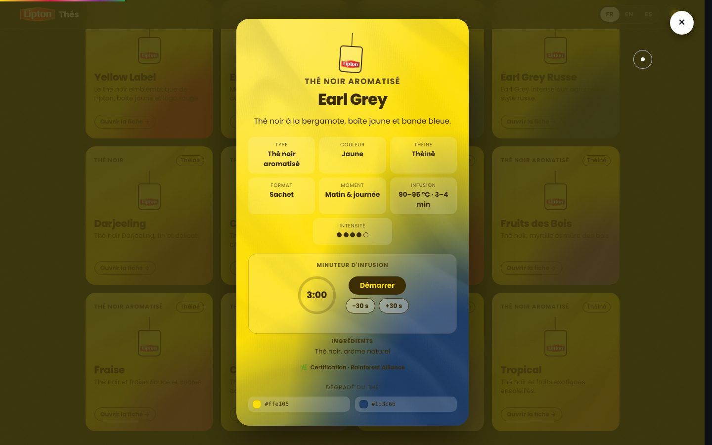
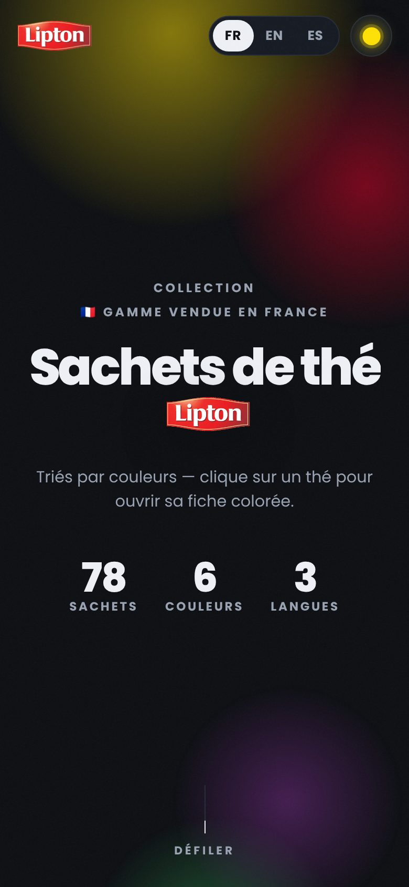

# Fiche produit — Lipton · Sachets de thé par couleurs

> **Choisir son thé à la couleur de sa boîte.**
> Toute la gamme Lipton vendue en France, rangée comme un nuancier : chaque
> sachet a sa fiche aux couleurs de sa boîte, avec son intensité, ses
> ingrédients et un minuteur d'infusion prêt à lancer.

| | |
| --- | --- |
| **Produit** | Lipton Thés — catalogue interactif des sachets de thé |
| **Plateformes** | Site web (PWA installable, hors-ligne) · app iOS native · API publique |
| **Langues** | Français, anglais, espagnol |
| **Contenu** | 78 références de la gamme vendue en France |
| **Conception & développement** | Maxime Nathan Lestage ([@maxlestage](https://github.com/maxlestage)) |

---

## L'idée

Devant un rayon de thé, on reconnaît une boîte à sa couleur bien avant de lire
son nom. L'app part de ce réflexe : au lieu d'une liste alphabétique, la gamme
est présentée **par familles de couleur** — jaune, ambre, rouge, rose, violet,
vert — puis chaque thé s'ouvre sur une **fiche colorée** qui reprend fidèlement
les teintes de sa boîte.

On y trouve en un coup d'œil ce qu'on cherche vraiment au moment de choisir :
**est-ce corsé ?** **Y a-t-il de la théine ?** **Combien de temps l'infuser ?**

## Pour qui

- **Les amateurs de thé** qui veulent explorer la gamme ou retrouver une boîte.
- **Les curieux** qui cherchent un thé selon le moment (journée ou soirée sans
  théine) ou selon l'intensité.
- **Les étudiants et développeurs** : l'API publique, documentée et pleine
  d'exercices, sert de terrain d'entraînement aux requêtes HTTP.

## Ce que fait l'app

| Fonction | Ce que ça apporte |
| --- | --- |
| 🎨 **Cartes aux couleurs des boîtes** | Dégradé fidèle (teinte dominante + bande d'accent du parfum), texte lisible calculé pour chaque carte, texture toile. |
| 🔘 **Filtres par couleur** | Un clic pour n'afficher que les thés verts, les coffrets… |
| 🗂️ **Trois tris** | Par **couleur**, par **intensité** (de « très corsé » à « très léger ») ou par **moment** (matin & journée / le soir). |
| 📋 **Fiche détaillée** | Type, couleur, théine, format (sachet, pyramide, infusion à froid, assortiment), moment conseillé, température et durée d'infusion, intensité sur 5, ingrédients, certification, nuancier hexadécimal. |
| ⏱️ **Minuteur d'infusion** | Pré-réglé sur la durée conseillée du thé, ajustable par 30 s ; bip et vibration à la fin, écran maintenu allumé pendant l'infusion. Reste juste même si l'onglet passe en arrière-plan. |
| 🌍 **Trilingue** | FR / EN / ES, détecté automatiquement puis mémorisé. |
| 🌗 **Clair / sombre** | Suit le réglage du système, bascule d'un geste. |
| 📲 **Installable & hors-ligne** | PWA : s'ajoute à l'écran d'accueil et fonctionne sans réseau. |
| 💾 **Préférences mémorisées** | Langue, thème, filtre, tri et sections repliées sont retrouvés à la visite suivante. |

## L'expérience : une app qui bouge comme un site d'agence

Le site adopte le langage de mouvement des sites de studios créatifs, au
service du produit :

- **Intro** — un rideau jaune Lipton, un sachet qui se balance et un compteur
  0 → 100 % le temps du chargement, puis le rideau se lève en goutte.
- **Titre lettre par lettre**, logo qui entre en pivotant, **chiffres clés**
  qui défilent jusqu'à leur valeur.
- **Halos de couleur** qui flottent en parallaxe avec la souris et le scroll.
- **Bandeaux défilants** de noms de thés, qui accélèrent et s'inclinent avec
  la vitesse du scroll.
- **Curseur sur mesure** : un point et un anneau à inertie, qui devient une
  pastille jaune « Ouvrir » au survol d'une carte ; **boutons magnétiques**.
- **Cartes en 3D** qui s'inclinent sous le pointeur, avec un reflet ; le petit
  sachet se balance au survol.
- **Apparitions en cascade** au fil du scroll, titres révélés par masque.
- **Fiche dévoilée en cercle** depuis le point exact du clic, et qui s'y
  referme.
- **Changement de thème en cercle** depuis le bouton.

Toutes ces animations s'effacent si l'appareil demande de **réduire les
animations** : le contenu s'affiche alors directement, sans rien perdre.

## Le catalogue en chiffres

| | |
| --- | --- |
| Références | **78** |
| Familles de couleur | **6** (jaune, ambre, rouge, rose, violet, vert) + coffrets |
| Types de thé | **9** (noir, noir aromatisé, vert, vert aromatisé, blanc, rooibos, infusions, infusions fruitées, coffrets) |
| Sans théine | **23** |
| Exclusive Selection (pyramides) | **11** |
| Infusion à froid | **5** |
| Éditions limitées | **4** |
| Coffrets / assortiments | **7** |

## Trois façons d'y accéder

### Site web (PWA)

Le cœur du produit, sur ordinateur comme sur mobile. Installable sur l'écran
d'accueil, utilisable hors-ligne.

  

### App iOS native

Une app **SwiftUI** 100 % native (aucune WebView) qui embarque le même
catalogue et fonctionne hors-ligne : écran de lancement animé, cartes et
fiches colorées, minuteur d'infusion mémorisé par thé, écran « À propos ».
Chaque mise à jour du dépôt est compilée et envoyée automatiquement sur
**TestFlight**. Elle pose aussi la base d'un futur **widget iPhone**.

### API publique

Tout le catalogue en **JSON**, en lecture libre (CORS ouvert), pensée aussi
comme support d'apprentissage :

- filtres (famille, type, théine, pyramide, infusion à froid, coffret, édition
  limitée, recherche texte), tri, pagination, sélection de champs, export **CSV** ;
- liens hypermédia, versionnage `/api/v1`, **ETag** / `304` ;
- guide d'infusion, glossaire, **quiz** et **exercices guidés** ;
- documentation écrite, **Swagger UI**, spécification **OpenAPI 3.1** et un
  **bac à sable** pour tester les requêtes en direct.

## Sous le capot

| Brique | Choix |
| --- | --- |
| Front | **Rust** + **Yew 0.23**, compilé en **WebAssembly** (wasm-bindgen 0.2.129) |
| Build | **Trunk 0.21** + **wasm-opt** (binaryen 133), Rust **1.97** figé |
| Animations | Moteur maison (`requestAnimationFrame` + variables CSS, sans re-rendu), View Transitions API, `@property` CSS |
| Serveur | **Node 24 LTS**, zéro dépendance : site + API, compression Brotli / gzip, ETag |
| Données | Un seul fichier, `data/teas.json`, partagé par le site, l'API et l'app iOS |
| iOS | SwiftUI, projet XcodeGen, CI GitHub Actions → TestFlight |
| Déploiement | Heroku (buildpack Node ou conteneur Docker multi-étapes) |
| Qualité | CI à chaque push : formatage, lint Clippy, build complet, test de fumée du serveur |

**Points forts techniques**

- **Léger** : tout le front tient en ~120 Ko de WebAssembly compressé, polices
  auto-hébergées, aucun appel à un service tiers.
- **Fiable** : le catalogue est compilé dans l'app et **vérifié au build**
  (couleurs, traductions, intensités…) — une donnée invalide ne peut pas
  atteindre la production.
- **Accessible** : navigation au clavier, focus rendu à la carte à la fermeture
  d'une fiche, libellés pour lecteurs d'écran, lien d'évitement, respect du
  réglage « réduire les animations ».
- **Source unique** : ajouter un thé = une entrée JSON, visible partout.

## Pistes pour la suite

- **Widget iPhone** affichant un thé du jour ou le minuteur en cours.
- **Favoris** et liste « à goûter ».
- **Recherche** plein texte dans l'interface (déjà disponible dans l'API).
- Partage d'une fiche par lien direct.

---

Conçu et développé par Maxime Nathan Lestage · @maxlestage. Lipton est une
marque de son propriétaire ; les noms et couleurs des produits servent à les
identifier.
