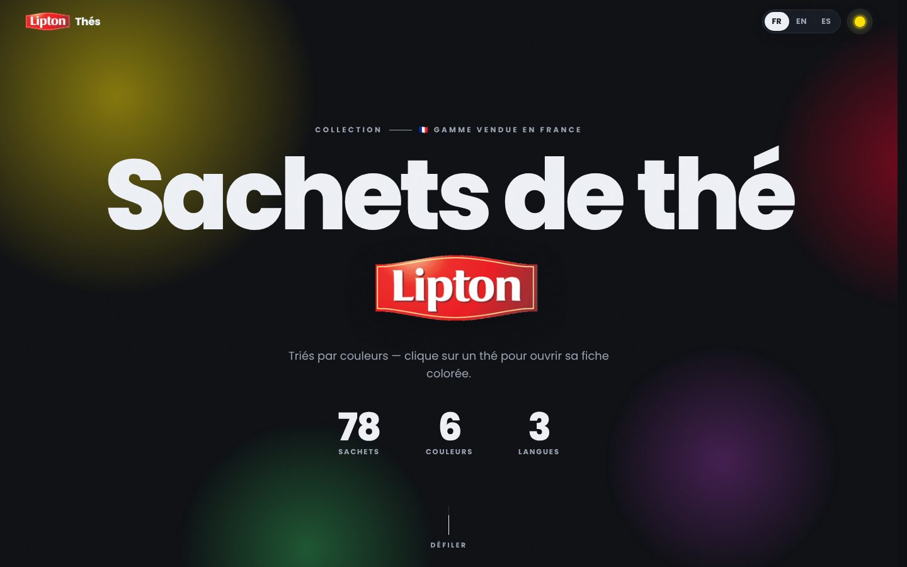
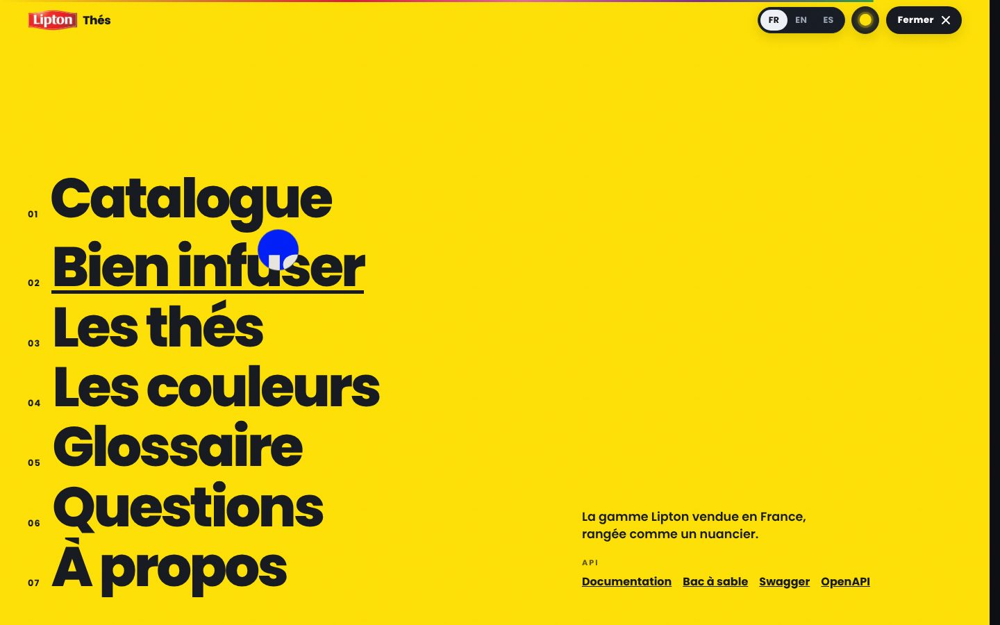
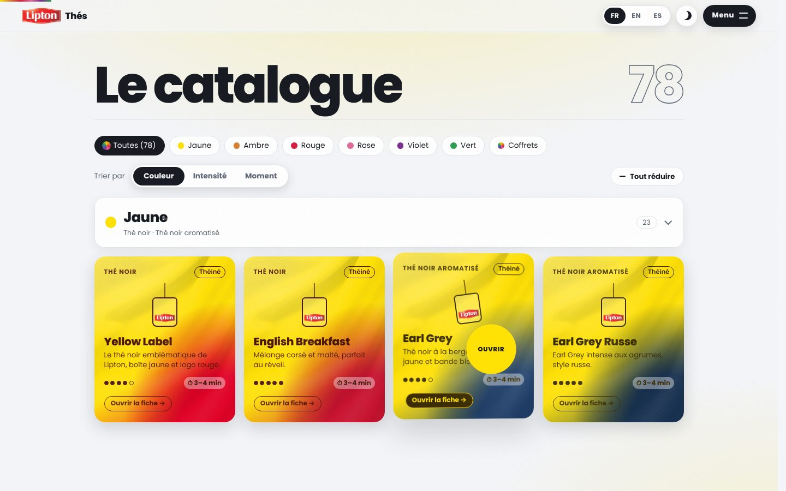
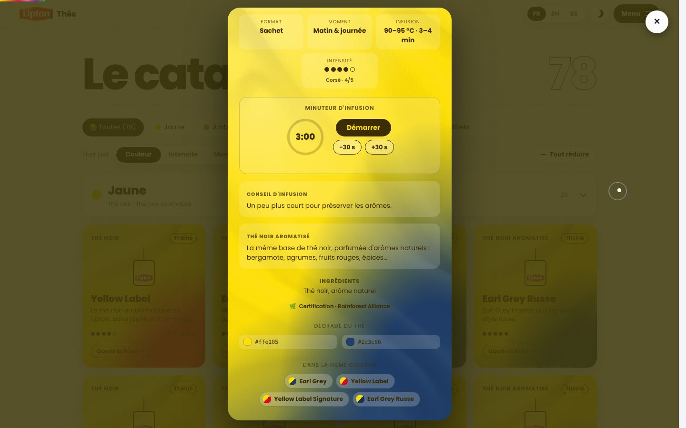
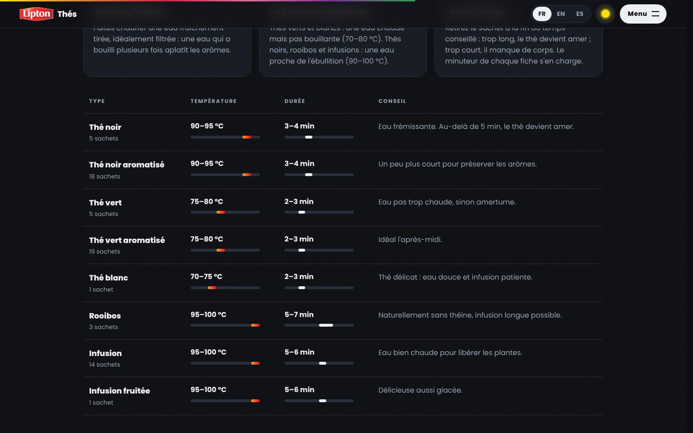
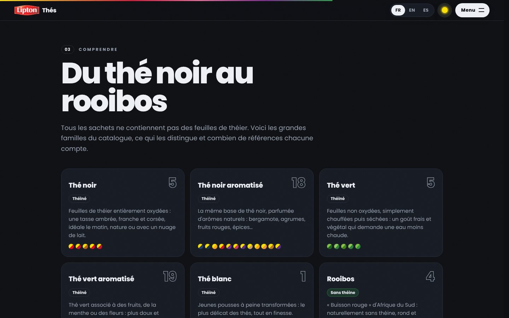
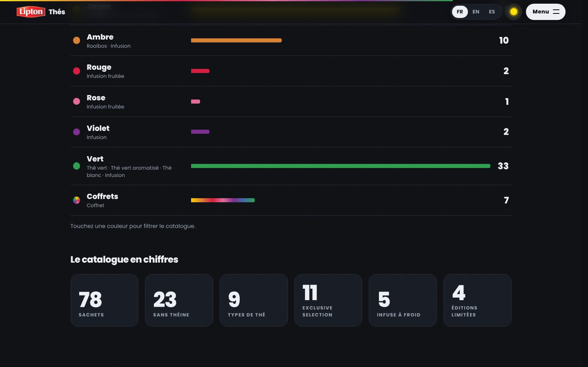
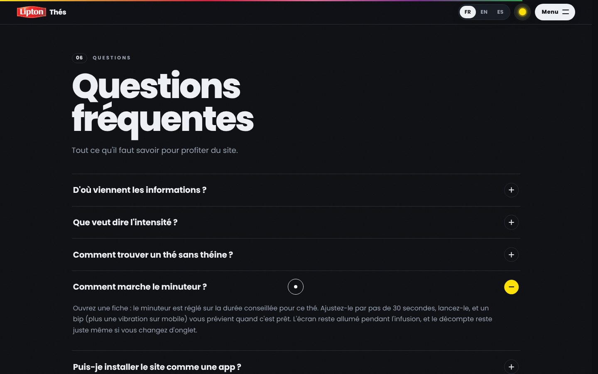
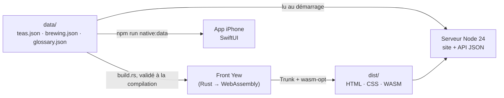

# Fiche produit — Lipton · Sachets de thé par couleurs



> **Choisir son thé à la couleur de sa boîte.**
> Toute la gamme Lipton vendue en France, rangée comme un nuancier : chaque
> sachet a sa fiche aux couleurs de sa boîte, avec son intensité, ses
> ingrédients, ses conseils d'infusion et un minuteur prêt à lancer. Autour du
> catalogue, le site explique comment bien infuser, ce qui distingue les types
> de thé, et répond aux questions courantes.

| | |
| --- | --- |
| **Produit** | Lipton Thés — catalogue interactif des sachets de thé |
| **Promesse** | Trouver le bon thé et le préparer correctement, en quelques secondes |
| **Plateformes** | Site web (PWA installable, hors-ligne) · app iPhone native · API publique |
| **Langues** | Français, anglais, espagnol (détection automatique, choix mémorisé) |
| **Contenu** | 78 références · 6 couleurs + coffrets · 9 types · 14 termes de glossaire · 9 questions/réponses |
| **Accès** | Gratuit, sans compte, sans cookie, sans mesure d'audience |
| **Conception & développement** | Maxime Nathan Lestage ([@maxlestage](https://github.com/maxlestage)) |

## Sommaire

1. [L'idée](#1-lidée)
2. [Pour qui, pour quoi faire](#2-pour-qui-pour-quoi-faire)
3. [Visite guidée du site](#3-visite-guidée-du-site)
4. [Le catalogue en chiffres](#4-le-catalogue-en-chiffres)
5. [Le mouvement : toutes les animations](#5-le-mouvement--toutes-les-animations)
6. [Accessibilité, confidentialité, hors-ligne](#6-accessibilité-confidentialité-hors-ligne)
7. [L'app iPhone](#7-lapp-iphone)
8. [L'API publique](#8-lapi-publique)
9. [Sous le capot](#9-sous-le-capot)
10. [Faire vivre le contenu](#10-faire-vivre-le-contenu)
11. [Limites connues et pistes](#11-limites-connues-et-pistes)

---

## 1. L'idée

Devant un rayon de thé, on reconnaît une boîte à sa couleur bien avant de lire
son nom. L'app part de ce réflexe : au lieu d'une liste alphabétique, la gamme
est présentée **par familles de couleur** — jaune, ambre, rouge, rose, violet,
vert, et les coffrets — et chaque thé s'ouvre sur une **fiche colorée** qui
reprend fidèlement les teintes de sa boîte : la couleur dominante, puis la
bande d'accent du parfum (le bleu de l'Earl Grey, le rouge des fruits rouges…).

Le site répond ensuite aux trois questions qu'on se pose au moment de choisir
et de préparer une tasse :

- **Est-ce corsé ?** — intensité notée de 1 à 5, thé par thé.
- **Y a-t-il de la théine ?** — indiqué sur chaque carte, et un tri « Moment »
  qui sépare la journée du soir.
- **Comment l'infuser ?** — température, durée, conseil, et un minuteur
  pré-réglé dans chaque fiche.

## 2. Pour qui, pour quoi faire

| Profil | Ce qu'il vient chercher | Ce que le site lui offre |
| --- | --- | --- |
| **L'amateur de thé** | Explorer la gamme, retrouver « la boîte jaune à bande bleue » | Tri et filtres par couleur, fiches détaillées, suggestions « Dans la même couleur » |
| **Le buveur du soir** | Un thé sans théine | Tri « Moment » → section « Le soir », mention sur chaque carte, FAQ dédiée |
| **Le débutant** | Ne plus rater son infusion | Guide « Bien infuser », minuteur par thé, glossaire |
| **Le curieux** | Comprendre la différence entre thé noir, vert, rooibos, infusion | Section « Du thé noir au rooibos », glossaire |
| **L'étudiant ou le développeur** | S'entraîner aux requêtes HTTP sur des données concrètes | API publique documentée, bac à sable, quiz, exercices guidés |

Quelques scénarios typiques :

- *« Il est 21 h, je veux quelque chose de doux sans théine. »* → Trier par
  **Moment**, ouvrir la section **Le soir**, choisir une intensité 1 ou 2.
- *« J'ai un thé vert, combien de temps ? »* → La fiche indique 75–80 °C ·
  2–3 min ; lancer le minuteur, un bip prévient à la fin.
- *« Je cherche la boîte violette de ma grand-mère. »* → Filtre **Violet** ou
  barre « Violet » dans « Pourquoi par couleurs ? ».

## 3. Visite guidée du site

Le site est une seule longue page, organisée en sections numérotées
accessibles depuis le menu.

### 3.1 Écran d'intro

Pendant le téléchargement de l'app (quelques dizaines de millisecondes à
quelques secondes selon la connexion), un écran jaune Lipton s'affiche
immédiatement : un sachet se balance au bout de sa ficelle, un grand compteur
monte vers 100 % et une barre progresse en bas. Une fois l'app prête, le
compteur termine sa course et le rideau se lève vers le haut avec un bord
arrondi, comme une goutte, en dévoilant l'accueil. L'intro dure au minimum
1,6 s pour rester lisible, et un filet de sécurité la retire au bout de 9 s
si le chargement échoue.

### 3.2 Barre d'outils et menu

Fixée en haut de l'écran, elle devient translucide (flou d'arrière-plan) dès
qu'on fait défiler la page. Elle contient :

- la **marque** (logo Lipton + « Thés »), qui ramène en haut ;
- le **choix de la langue** FR / EN / ES, avec une pastille qui glisse ;
- le **bouton de thème** (soleil ↔ lune) : le nouveau thème se dévoile en
  cercle depuis le bouton ;
- le bouton **Menu** : il ouvre un menu plein écran jaune, avec sept grands
  liens numérotés (Catalogue, Bien infuser, Les thés, Les couleurs, Glossaire,
  Questions, À propos), qui montent un à un ; un trait se dessine sous le lien
  survolé. Le menu rappelle aussi la promesse du site et donne les liens de
  l'API. Il se ferme avec le bouton « Fermer », la touche Échap ou en
  choisissant une section.

Une fine **barre de progression** aux couleurs des familles indique la
position dans la page.



### 3.3 Accueil

- Sur-titre « Collection — 🇫🇷 Gamme vendue en France ».
- Grand titre **« Sachets de thé »**, dont les lettres montent une à une,
  suivi du logo Lipton qui entre en pivotant.
- Phrase d'accroche : « Triés par couleurs — clique sur un thé pour ouvrir sa
  fiche colorée. »
- Trois **chiffres clés** qui défilent jusqu'à leur valeur : 78 sachets,
  6 couleurs, 3 langues.
- Des **halos colorés** (jaune, rouge, vert, violet) qui flottent et se
  déplacent légèrement avec la souris et le défilement.
- Un indicateur « Défiler » qui mène au catalogue.

### 3.4 Bandeaux défilants

Deux grands bandeaux traversent l'écran en sens opposés : l'un avec une
sélection de noms de thés (chacun précédé d'une pastille à ses deux
couleurs), l'autre avec les noms des couleurs en lettres détourées. Ils
accélèrent et s'inclinent quand on fait défiler la page vite.

### 3.5 Le catalogue



- **En-tête** : « Le catalogue » et le nombre de sachets affichés, en grands
  chiffres détourés.
- **Filtres** : « Toutes (78) » et une pastille par couleur ; un clic
  n'affiche que cette famille.
- **Tri** (contrôle à pastille glissante) :
  - **Couleur** — une section par famille, dans l'ordre jaune → vert, puis
    coffrets ;
  - **Intensité** — de « Très corsé · 5/5 » à « Très léger · 1/5 », coffrets
    à part ;
  - **Moment** — « Matin & journée » (avec théine) et « Le soir » (sans
    théine), coffrets à part.
- **Sections repliables** : chaque en-tête rappelle la couleur (ou
  l'intensité, ou le moment), les types de thé qu'il réunit (« Thé noir · Thé
  noir aromatisé ») et le nombre de sachets. Un bouton « Tout réduire / Tout
  déplier » agit sur toutes les sections.
- **Cartes** : dégradé aux couleurs de la boîte et texture toile ; type de
  thé, mention « Théiné » ou « Sans théine », sachet illustré, badges de gamme
  (✦ Exclusive Selection, ❄ Infuse à froid, ★ Édition limitée), nom,
  description, **intensité** (points) et **durée d'infusion**, bouton « Ouvrir
  la fiche ». Au survol, la carte s'incline en 3D sous le pointeur avec un
  reflet, le sachet se balance et le curseur affiche « Ouvrir ».

Filtre, tri et sections repliées sont mémorisés d'une visite à l'autre.

### 3.6 La fiche d'un thé

Un clic sur une carte dévoile la fiche **en cercle depuis le point du clic** ;
le fond se teinte de la couleur du thé. Le contenu de la fiche apparaît en
cascade :

| Élément | Contenu |
| --- | --- |
| En-tête | Sachet qui se balance, type, badges de gamme, nom |
| Description | Le thé en une phrase |
| Faits | Type · Couleur · Théine · Format (sachet, pyramide, infusion à froid, assortiment) · Moment conseillé · Infusion (température et durée) · Intensité (points + « Corsé · 4/5 ») |
| Minuteur | Voir 3.7 |
| Conseil d'infusion | Le conseil propre au type (ou à la gamme à froid) |
| Le type expliqué | Ce qui caractérise ce type de thé |
| La gamme | Explication d'Exclusive Selection, d'Infuse à froid ou de l'édition limitée, si le thé en fait partie |
| Ingrédients | Liste réelle pour les références documentées, sinon ingrédients du type |
| Certification | Rainforest Alliance |
| Dégradé du thé | Les deux couleurs de la boîte avec leur code hexadécimal |
| Dans la même couleur | Jusqu'à quatre thés de la même famille, les plus proches en intensité : un clic ouvre leur fiche à la place |

La fiche se ferme avec la croix, un clic à côté ou la touche Échap ; elle se
referme alors en cercle vers son point d'origine et le focus revient sur la
carte.



### 3.7 Le minuteur d'infusion

- Pré-réglé sur la **durée minimale conseillée** du thé (ex. 3:00 pour un thé
  noir), ajustable par pas de **30 secondes** entre 30 s et 20 min.
- Cadran circulaire qui se remplit, chiffres tabulaires, cadran qui « respire »
  pendant l'infusion.
- Boutons Démarrer / Pause / Reprendre / Réinitialiser.
- En fin d'infusion : **trois bips** (Web Audio), **vibration** sur mobile,
  message « C'est prêt 🍵 » et la carte pulse.
- L'écran reste **allumé** pendant l'infusion (Screen Wake Lock), et le
  décompte s'appuie sur l'heure réelle : il reste juste même si l'onglet passe
  en arrière-plan.

### 3.8 Bien infuser



- **Trois règles d'or** : une eau fraîche, la bonne température, le bon temps.
- **Un tableau par type** : température (avec une jauge de 60 à 100 °C),
  durée (jauge de 0 à 10 min), conseil, et nombre de sachets concernés.

| Type | Température | Durée |
| --- | --- | --- |
| Thé noir, thé noir aromatisé | 90–95 °C | 3–4 min |
| Thé vert, thé vert aromatisé | 75–80 °C | 2–3 min |
| Thé blanc | 70–75 °C | 2–3 min |
| Rooibos | 95–100 °C | 5–7 min |
| Infusions, infusions fruitées | 95–100 °C | 5–6 min |
| Gamme Infuse à froid | Eau froide | 5–10 min |

Sur mobile, le tableau se transforme en cartes empilées.

### 3.9 Du thé noir au rooibos



Une carte par type présent dans le catalogue : nom, nombre de références,
mention de théine, explication (oxydation, goût, moment idéal) et un aperçu
des couleurs de ses boîtes. Puis les trois **gammes** sur fond jaune :
Exclusive Selection (sachets pyramides), Infuse à froid, éditions limitées,
avec leur nombre de références.

### 3.10 Pourquoi par couleurs ?



- Le parti pris du site expliqué en un paragraphe.
- Une **barre par couleur**, proportionnelle au nombre de sachets, avec les
  types qu'elle réunit. Chaque barre est un bouton : un clic **filtre le
  catalogue** sur cette couleur et y ramène.
- **Le catalogue en chiffres** : 78 sachets, 23 sans théine, 9 types,
  11 Exclusive Selection, 5 infuse à froid, 4 éditions limitées, 7 coffrets,
  3 langues — chaque chiffre défile jusqu'à sa valeur quand il apparaît.

### 3.11 Les mots du thé

Un glossaire de **14 termes**, classés par ordre alphabétique dans la langue
choisie : arôme naturel, bergamote, coffret, édition limitée, hibiscus,
infusion, infusion à froid, intensité, matcha, oxydation, Rainforest
Alliance, rooibos, sachet pyramide, théine. C'est le même glossaire que celui
de l'API.

### 3.12 Questions fréquentes



Neuf questions en accordéon (une icône + qui pivote en −, la réponse se
déplie en douceur) :

1. D'où viennent les informations ?
2. Que veut dire l'intensité ?
3. Comment trouver un thé sans théine ?
4. Comment marche le minuteur ?
5. Puis-je installer le site comme une app ?
6. Existe-t-il une app iPhone ?
7. Mes données sont-elles collectées ?
8. Les animations me gênent.
9. Puis-je réutiliser les données ? (avec les liens vers l'API)

### 3.13 À propos et pied de page

- **À propos** : le projet, ses trois déclinaisons (le site, l'app iPhone,
  l'API), les liens Documentation · Bac à sable · Swagger · OpenAPI, les
  crédits et la mention de marque.
- **Pied de page** : la signature « Une couleur, un thé. » en très grand, un
  bouton rond jaune pour remonter, le plan du site (sept sections), les liens
  API, le copyright.

## 4. Le catalogue en chiffres

**Par couleur**

| Couleur | Sachets | Types réunis |
| --- | ---: | --- |
| Jaune | 23 | Thé noir (5), thé noir aromatisé (18) |
| Ambre | 10 | Rooibos (4), infusion (6) |
| Rouge | 2 | Infusion fruitée (2) |
| Rose | 1 | Infusion fruitée (1) |
| Violet | 2 | Infusion (2) |
| Vert | 33 | Thé vert (5), thé vert aromatisé (19), infusion (8), thé blanc (1) |
| Coffrets | 7 | Assortiments |
| **Total** | **78** | |

**Par type** : thé noir 5 · thé noir aromatisé 18 · thé vert 5 · thé vert
aromatisé 19 · thé blanc 1 · rooibos 4 · infusion 16 · infusion fruitée 3 ·
coffrets 7.

**Par intensité** (hors coffrets) : 1/5 → 7 · 2/5 → 29 · 3/5 → 26 ·
4/5 → 5 · 5/5 → 4.

**Par moment** : 48 avec théine (matin & journée), 23 sans théine (le soir),
7 coffrets.

**Gammes** : 11 Exclusive Selection · 5 Infuse à froid · 4 éditions limitées
(Infusion Façon Pain d'Épices, Sablé de Noël, Thé de Noël Épices, Coffret
Édition Limitée).

## 5. Le mouvement : toutes les animations

Le site adopte le langage de mouvement des sites de studios créatifs, au
service de la lecture.

| Animation | Où | Comportement |
| --- | --- | --- |
| Intro et rideau | Chargement | Compteur 0 → 100 %, sachet qui se balance, rideau qui se lève en goutte |
| Lettres en cascade | Titre de l'accueil | Chaque lettre monte d'un masque avec une légère rotation ; rejoué au changement de langue |
| Logo qui pivote | Accueil | Entrée avec rebond |
| Compteurs | Chiffres clés, « en chiffres » | Défilent de 0 à leur valeur à l'apparition |
| Halos en parallaxe | Accueil | Flottent en continu, suivent la souris et le défilement |
| Bandeaux défilants | Sous l'accueil | Vitesse et inclinaison liées à la vitesse du scroll |
| Curseur sur mesure | Partout (souris) | Point + anneau à inertie ; s'agrandit sur les boutons ; pastille « Ouvrir » sur les cartes |
| Boutons magnétiques | Marque, filtres, menu, thème, liens API… | Attirés vers le pointeur, reviennent en ressort |
| Cartes 3D | Catalogue | Inclinaison sous le pointeur, reflet, élévation, sachet qui se balance |
| Apparitions au scroll | Toutes les sections | Fondu + montée en cascade ; titres révélés par masque ; jauges et barres qui se remplissent |
| Fiche en cercle | Ouverture / fermeture | Se dévoile depuis le point du clic et s'y referme |
| Thème en cercle | Bouton soleil / lune | Le nouveau thème se propage en cercle (View Transitions) |
| Menu plein écran | Bouton Menu | Rideau jaune, liens qui montent un à un, soulignement au survol |
| Pastilles glissantes | Langue, tri | La pastille glisse vers l'option choisie |
| Accordéon | FAQ | Déploiement en douceur, icône + → − |
| Barre de progression | Haut de l'écran | Suit la position dans la page |

Tout est désactivé si l'appareil demande de **réduire les animations** : pas
d'intro, pas de curseur, pas de mouvement ; le contenu s'affiche directement.

## 6. Accessibilité, confidentialité, hors-ligne

**Accessibilité**

- Navigation complète au clavier, lien d'évitement « Aller au catalogue ».
- Focus placé sur la croix à l'ouverture d'une fiche, rendu à la carte à la
  fermeture ; menu fermé avec Échap, focus rendu au bouton.
- Libellés pour les lecteurs d'écran (cartes, chiffres animés, intensité),
  accordéon natif `<details>`, tableau d'infusion en vrai tableau.
- Respect du réglage système « réduire les animations ».
- Contraste : chaque thé a sa propre couleur d'encre, choisie pour rester lisible sur son dégradé.

**Confidentialité**

- Aucun compte, aucun cookie, aucune mesure d'audience, aucune police ou
  script tiers sur le site.
- Les préférences (langue, thème, filtre, tri, sections repliées) restent
  dans le navigateur (stockage local).

**Hors-ligne et installation**

- PWA : installable sur l'écran d'accueil (iPhone, Android, ordinateur).
- Un service worker garde le site et ses assets en cache : le catalogue
  fonctionne sans réseau après une première visite. L'API, elle, est toujours
  appelée en direct.

## 7. L'app iPhone

Une app **SwiftUI 100 % native** (aucune WebView), qui embarque le même
catalogue (`data/teas.json`) et fonctionne hors-ligne :

- écran de lancement animé, avec un fond tiré au sort parmi les thés et les
  crédits ;
- grille de cartes aux couleurs des boîtes, sections par famille, filtres et
  tri ;
- fiche détaillée et **minuteur d'infusion mémorisé par thé** ;
- écran « À propos » avec les crédits ;
- trois langues, mode clair / sombre automatique.

Chaque push sur la branche principale déclenche une chaîne automatique :
génération du projet (XcodeGen), compilation de contrôle, archive et envoi
sur **TestFlight** (numéro de build automatique). L'app native pose aussi la
base d'un futur **widget iPhone**, qui exige une extension WidgetKit.

## 8. L'API publique

Tout le catalogue en **JSON**, en lecture libre (CORS ouvert), pensée aussi
comme support d'apprentissage. Toutes les routes existent aussi sous
`/api/v1/…`.

| Route | Rôle |
| --- | --- |
| `GET /api` | Index auto-documenté |
| `GET /api/teas` | Liste des sachets : filtres, tri, pagination, champs, CSV |
| `GET /api/teas/random` | Un sachet au hasard (respecte les filtres) |
| `GET /api/teas/:id` | Un sachet |
| `GET /api/families` | Familles de couleur et effectifs |
| `GET /api/types` | Types de thé et effectifs |
| `GET /api/stats` | Statistiques globales |
| `GET /api/brewing` | Guide d'infusion par type |
| `GET /api/glossary` | Glossaire (le même que sur le site) |
| `GET /api/quiz` | Une question de quiz générée depuis le catalogue |
| `GET /api/exercises` | Exercices guidés |
| `GET /api/openapi.json` | Spécification OpenAPI 3.1 |
| `GET /api/docs` | Documentation écrite |
| `GET /api/swagger` | Swagger UI |
| `GET /api/playground` | Bac à sable pour tester en direct |

- **Filtres** : `family`, `type`, `search` (nom et description, trois
  langues), `caffeineFree`, `pyramid`, `coldBrew`, `coffret`, `limited`,
  `lang` (aplatit les textes).
- **Tri et pagination** : `sort` (id, name, family, type), `order`,
  `limit`, `offset` ; réponses avec `total`, `meta` et liens `_links`
  (self, next, prev, first, last).
- **Formats** : `format=csv` pour l'export tableur, `fields=` pour ne garder
  que certains champs.
- **Cache** : ETag sur chaque réponse, `304 Not Modified` sur `If-None-Match`.

```bash
curl "https://<app>/api/teas?family=Vert&lang=en"
curl "https://<app>/api/teas?caffeineFree=true&sort=name"
curl "https://<app>/api/teas?format=csv" -o sachets.csv
```

## 9. Sous le capot



| Brique | Choix |
| --- | --- |
| Front | **Rust** + **Yew 0.23**, compilé en **WebAssembly** (wasm-bindgen 0.2.129) |
| Build | **Trunk 0.21** + **wasm-opt** (binaryen 133), Rust **1.97** figé par `rust-toolchain.toml` |
| Animations | Moteur maison (`src/motion.rs` : boucle `requestAnimationFrame` qui écrit des variables CSS, sans re-rendu), IntersectionObserver, View Transitions API, `@property` CSS |
| Serveur | **Node 24 LTS**, zéro dépendance : sert le site et l'API, compression Brotli / gzip, ETag |
| Données | Trois fichiers JSON dans `data/`, partagés par le site, l'API et l'app iOS |
| iOS | SwiftUI, XcodeGen, GitHub Actions → TestFlight |
| Déploiement | Heroku : buildpack Node (Rust et Trunk installés au build) ou conteneur Docker multi-étapes |
| Qualité | CI à chaque push : formatage, lint Clippy, build complet, test de fumée du serveur |

**Performance** — tout le front (logique, textes des trois langues, catalogue)
tient dans un fichier WebAssembly d'environ **150 Ko compressé**, plus ~9 Ko
de CSS et ~8 Ko de JavaScript de démarrage. Les polices sont auto-hébergées ;
les données sont compilées dans l'app (aucune requête pour afficher le
catalogue).

**Fiabilité** — le catalogue, les conseils et le glossaire sont **vérifiés à
la compilation** : couleurs au format `#rrggbb`, familles et types connus,
intensité de 1 à 5, traductions présentes, nombre de sachets cohérent. Une
donnée invalide bloque le build au lieu d'arriver en production.

## 10. Faire vivre le contenu

| Pour… | Modifier | Effet |
| --- | --- | --- |
| Ajouter ou corriger un thé | `data/teas.json` (+ `count`) | Site, API ; `npm run native:data` pour l'app iOS |
| Changer un conseil d'infusion | `data/brewing.json` | Fiches, guide « Bien infuser », API `/api/brewing` |
| Ajouter un terme au glossaire | `data/glossary.json` | Section glossaire, API `/api/glossary` |
| Changer un texte du site | `src/content.rs` (sections) ou `src/i18n.rs` (interface) | Site, dans les trois langues |

## 11. Limites connues et pistes

**Limites**

- Les informations décrivent la gamme vendue en France à un instant donné ;
  elles ne remplacent pas l'emballage.
- Les températures et durées affichées par le site et l'app iPhone sont
  identiques ; celles renvoyées par `/api/brewing` diffèrent légèrement pour
  quelques types (par exemple 1–3 min pour le thé vert). À harmoniser.
- La famille « Bleu » est prévue mais ne compte aucune référence aujourd'hui.

**Pistes**

- Widget iPhone : un thé du jour ou le minuteur en cours.
- Favoris et liste « à goûter ».
- Recherche plein texte dans l'interface (déjà disponible dans l'API).
- Lien direct vers la fiche d'un thé, pour la partager.

---

<sub>Conçu et développé par Maxime Nathan Lestage · @maxlestage. Lipton est une
marque de son propriétaire ; les noms et couleurs des produits servent à les
identifier.</sub>
